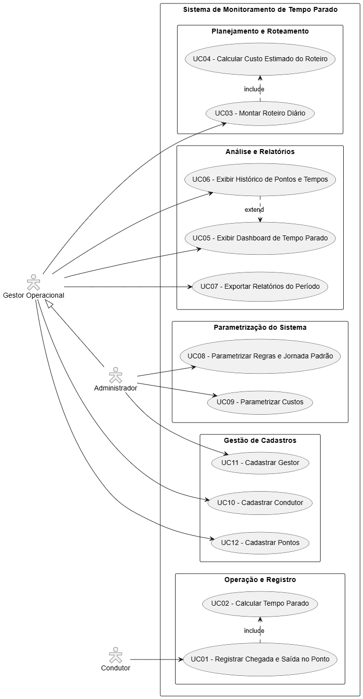
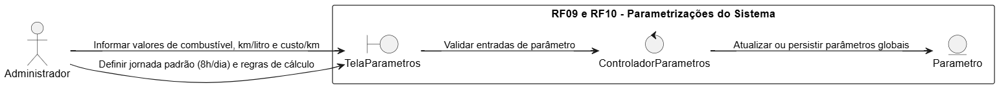
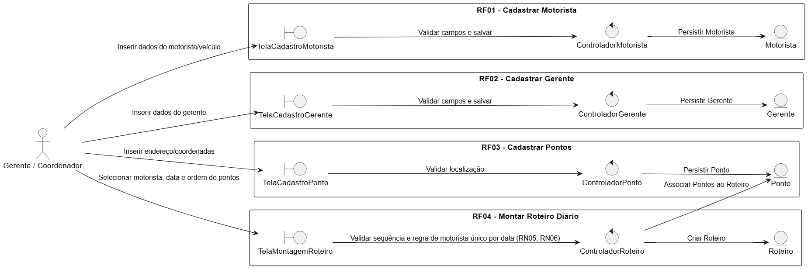
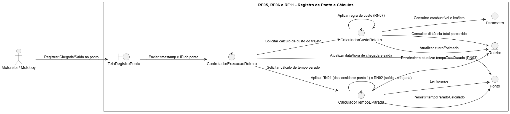
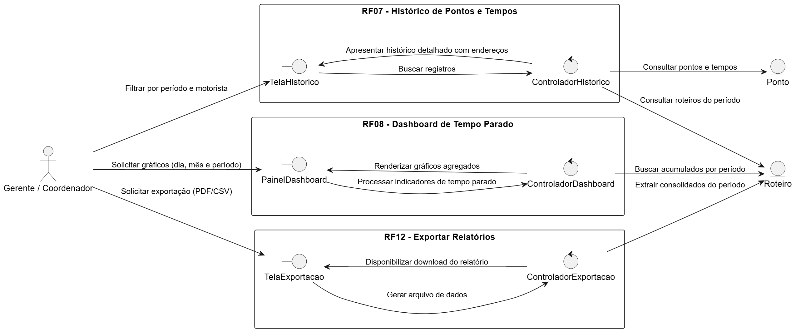
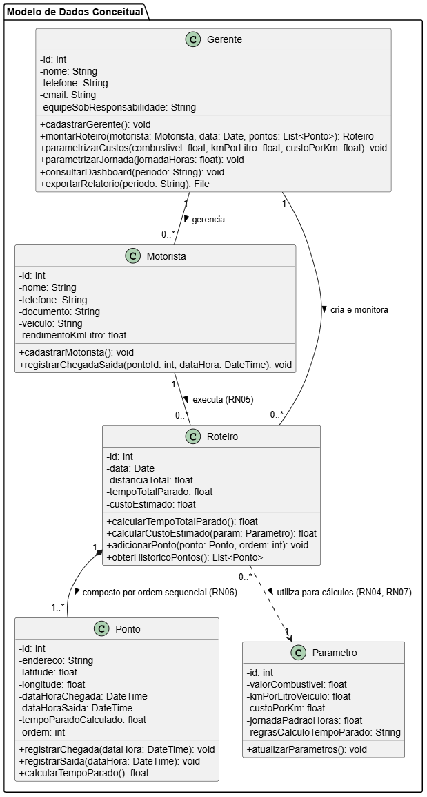
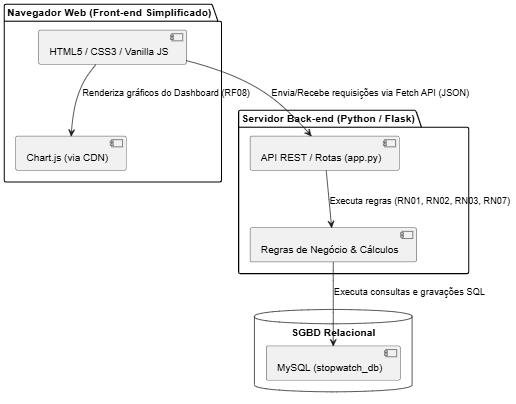
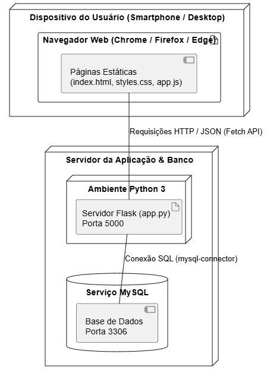

# WaitLess Logistics - Especificação de Requisitos e Artefatos
**MVP — git**  
**Engenharia de Software II**

Por: Alex Marques

---

## 1. Diagrama de Casos de Uso (PlantUML)

---

## 2. Especificação Detalhada dos Casos de Uso

### Módulo: Operação e Registro

#### UC01 - Registrar Chegada e Saída no Ponto
* **Ator Principal:** Condutor
* **Resumo:** Permite ao condutor registrar a entrada e saída em determinado ponto de entrega ou parada do roteiro.
* **Pré-condições:** Condutor autenticado no sistema e com roteiro diário atribuído.
* **Fluxo Principal:**
  1. O condutor seleciona o ponto correspondente na lista do roteiro.
  2. O condutor aciona o registro de chegada ou saída.
  3. O sistema captura a hora exata e a localização via GPS.
  4. O sistema armazena a transação.
  5. O sistema executa o **UC02 - Calcular Tempo Parado**.
* **Pós-condições:** Horário e status do ponto atualizados com sucesso.

---

#### UC02 - Calcular Tempo Parado
* **Ator Principal:** Sistema (Interno)
* **Resumo:** Calcula automaticamente a diferença entre o tempo de chegada e o tempo de saída no ponto, determinando o tempo total de permanência.
* **Pré-condições:** Existência de registros válidos de chegada e saída para o mesmo ponto (**UC01**).
* **Fluxo Principal:**
  1. O sistema obtém o horário de chegada e o horário de saída registrados.
  2. O sistema calcula o intervalo de tempo transcorrido.
  3. O sistema compara o valor obtido com a jornada/tempo tolerável cadastrado.
  4. O sistema grava a métrica de tempo parado associada ao histórico do condutor.
* **Pós-condições:** Tempo parado consolidado para visualização em relatórios e dashboards.

---

### Módulo: Planejamento e Roteamento

#### UC03 - Montar Roteiro Diário
* **Ator Principal:** Gestor Operacional
* **Resumo:** Permite criar e estruturar a sequência de pontos que um condutor deve cumprir em uma determinada data.
* **Pré-condições:** Condutor e pontos previamente cadastrados no sistema.
* **Fluxo Principal:**
  1. O gestor seleciona a data e o condutor responsável.
  2. O gestor inclui os pontos de parada e define a ordem da rota.
  3. O sistema executa o **UC04 - Calcular Custo Estimado do Roteiro**.
  4. O gestor confirma a criação do roteiro.
  5. O sistema disponibiliza o roteiro para o condutor.
* **Pós-condições:** Roteiro cadastrado e atribuído ao condutor.

---

#### UC04 - Calcular Custo Estimado do Roteiro
* **Ator Principal:** Sistema (Interno)
* **Resumo:** Calcula o custo estimado da rota com base na distância total, tempo esperado e parâmetros de custos vigentes.
* **Pré-condições:** Roteiro em montagem contendo ao menos dois pontos válidos (**UC03**).
* **Fluxo Principal:**
  1. O sistema lê as rotas entre os pontos do roteiro.
  2. O sistema aplica os parâmetros de custo (custo por km, hora parada, combustível).
  3. O sistema exibe o custo estimado total para apoio na tomada de decisão do gestor.
* **Pós-condições:** Custo estimado atrelado ao roteiro diário.

---

### Módulo: Análise e Relatórios

#### UC05 - Exibir Dashboard de Tempo Parado
* **Ator Principal:** Gestor Operacional
* **Resumo:** Apresenta indicadores gráficos consolidados sobre tempos parados, rotas e desvios operacionais.
* **Pré-condições:** Existência de dados de execução de roteiros registrados no sistema.
* **Fluxo Principal:**
  1. O gestor acessa o módulo de relatórios.
  2. O sistema exibe os gráficos operacionais do dia/período (ex: tempo médio parado, alertas de desvio).
* **Pós-condições:** Indicadores exibidos em tela.

---

#### UC06 - Exibir Histórico de Pontos e Tempos
* **Ator Principal:** Gestor Operacional
* **Resumo:** Permite ao gestor visualizar detalhadamente os tempos parados e trajetos individuais a partir do dashboard.
* **Pré-condições:** Dashboard de tempo parado em exibição (**UC05**).
* **Fluxo Principal:**
  1. O gestor seleciona um indicador ou veículo específico no dashboard.
  2. O sistema exibe a lista cronológica detalhada com pontos de parada, horários de entrada, saída e totais parados.
* **Pós-condições:** Histórico detalhado apresentado ao gestor.

---

#### UC07 - Exportar Relatórios do Período
* **Ator Principal:** Gestor Operacional
* **Resumo:** Gera e exporta arquivos de relatórios analíticos em formatos como PDF ou CSV/Excel.
* **Pré-condições:** Gestor com acesso às telas de relatório.
* **Fluxo Principal:**
  1. O gestor seleciona o período e o formato de arquivo desejado (PDF/CSV).
  2. O sistema compila as estatísticas do período.
  3. O sistema disponibiliza o download do arquivo.
* **Pós-condições:** Arquivo de relatório transferido para o usuário.

---

### Módulo: Parametrização do Sistema

#### UC08 - Parametrizar Regras e Jornada Padrão
* **Ator Principal:** Administrador
* **Resumo:** Permite definir os limites de tempo de parada, tempos de tolerância e parâmetros gerais de jornada de trabalho.
* **Pré-condições:** Usuário autenticado com perfil de Administrador.
* **Fluxo Principal:**
  1. O administrador acessa as configurações do sistema.
  2. O administrador insere/edita as regras de tolerância e horas de trabalho padrão.
  3. O sistema valida e salva as novas regras.
* **Pós-condições:** Regras operacionais atualizadas globalmente.

---

#### UC09 - Parametrizar Custos
* **Ator Principal:** Administrador
* **Resumo:** Configura os valores financeiros unitários (valor da hora parada, custo por km rodado, etc.) utilizados nos cálculos de estimativas.
* **Pré-condições:** Usuário autenticado com perfil de Administrador.
* **Fluxo Principal:**
  1. O administrador acessa a tela de parâmetros financeiros.
  2. Define os custos unitários de hora, quilometragem e operação.
  3. O sistema atualiza a tabela de preços do sistema.
* **Pós-condições:** Parâmetros de custos atualizados.

---

### Módulo: Gestão de Cadastros

#### UC10 - Cadastrar Condutor
* **Ator Principal:** Gestor Operacional
* **Resumo:** Permite a inclusão, alteração ou inativação do cadastro de condutores (motoristas/motoboys).
* **Pré-condições:** Acesso liberado ao módulo de cadastros.
* **Fluxo Principal:**
  1. O gestor informa dados pessoais e de CNH do condutor.
  2. O sistema valida as informações e grava o registro.
* **Pós-condições:** Condutor apto para receber atribuição de roteiros.

---

#### UC11 - Cadastrar Gestor
* **Ator Principal:** Administrador
* **Resumo:** Gerencia o cadastro de usuários com perfil de Gestor Operacional no sistema.
* **Pré-condições:** Usuário autenticado com perfil de Administrador.
* **Fluxo Principal:**
  1. O administrador preenche os dados do novo gestor e suas credenciais de acesso.
  2. O sistema salva os dados e define o perfil de acesso.
* **Pós-condições:** Novo gestor cadastrado e liberado para operar.

---

#### UC12 - Cadastrar Pontos
* **Ator Principal:** Gestor Operacional
* **Resumo:** Cadastra os locais geográficos (clientes, depósitos, paradas obrigatórias) que compõem os roteiros.
* **Pré-condições:** Permissão de acesso ao cadastro de pontos.
* **Fluxo Principal:**
  1. O gestor informa o nome do ponto, endereço e coordenadas geográficas (latitude/longitude).
  2. O sistema valida as coordenadas e efetua o registro.
* **Pós-condições:** Ponto geográfico disponível para inclusão nos roteiros diários.

## 3. Diagramas de Robustez (BCE)

### 3.1 Módulo de Parametrização do Sistema

### 3.2  Módulo de Cadastros e Roteamento

### 3.3 Módulo de Operação e Execução de Roteiro

### 3.4 Módulo de Análise e Relatórios

---

## 4. Diagrama de Classes Conceitual

---

## 5. Proposta de Valor

### 5.1 Nome do Produto
**WaitLess Logistics**  
*Mantra:* Precisão e transparência na gestão de tempos parados e custos de frota.

### 5.2 Campanha de Divulgação (Pitch de Vendas)

**Título:** *Elimine o tempo invisível da sua operação logística.*

* **O Problema:** A sua empresa sabe quanto tempo os veículos passam na estrada, mas sabe exatamente quanto tempo ficam parados em cada cliente ou ponto do trajeto? O tempo ocioso não registado gera gargalos, atrasos e custos ocultos com combustível e mão de obra.
* **A Solução:** O **WaitLess Logistics** é uma plataforma web responsiva desenvolvida para monitorizar a duração exata de cada paragem ao longo da rota diária dos seus condutores.
* **Principais Benefícios:**
  * **Zero Invisibilidade:** Cronometragem automática de permanência em cada ponto com associação de moradas e geolocalização.
  * **Dashboards Inteligentes:** Gráficos interativos com visões detalhadas por dia, mês e período.
  * **Controlo de Custos Real:** Indicadores automáticos de custo por quilómetro rodado e rendimento do combustível.
  * **Usabilidade Simples:** Interface otimizada para ser utilizada por motoristas e motoboys diretamente no smartphone.

---

## 6. Especificação das Tecnologias Usadas

Adotou-se uma **pilha leve, simples e direta (Monolítica / REST API simples)** para priorizar a facilidade de implementação, alta legibilidade e rapidez na entrega do MVP[cite: 1]:

### 6.1 Front-end
* **HTML5:** Estrutura semântica das telas de login, registro de ponto, cadastros e visualização do dashboard.
* **CSS3 (Puro):** Estilização leve e responsiva (layout *mobile-first*) adaptada para uso do entregador em navegadores móveis (RNF02)[cite: 1].
* **JavaScript (Vanilla / Fetch API):** Manipulação da interface no cliente e comunicação assíncrona via JSON com o servidor Python.
* **Chart.js (via CDN):** Biblioteca JS para renderização dos gráficos de tempo parado (por dia, mês e período) com tempo de resposta ágil (RF08, RNF03)[cite: 1].

### 6.2 Back-end
* **Linguagem:** **Python 3**
* **Framework Web:** **Flask** (Framework micro e minimalista para criação rápida de rotas REST HTTP).
* **Biblioteca de Conexão DB:** `mysql-connector-python` ou `Flask-SQLAlchemy` para comunicação limpa com o banco relacional.

### 6.3 Banco de Dados (SGBD)
* **MySQL:** Banco de dados relacional para persistência segura das informações dos pontos, rotas, usuários e configurações globais (RNF01)[cite: 1].

---

## 7. Diagramas Arquiteturais

### 7.1 Diagrama de Componentes (PlantUML)

### 7.2 Diagrama de Execução (PlantUML)

